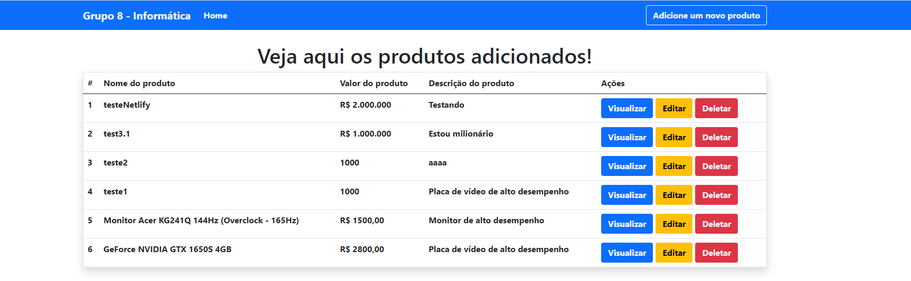

# CRUD - JavaScript :file_folder:
:bookmark_tabs: **CRUD utilizando Java Script**

## Membros do Grupo 8

:boy: **- Lucas Alves Moreira**

:boy: **- Lucas Galdino**

:boy: **- Maurício Alves Moreira**

:boy: **- Vitor Geovani**

:boy: **- Tiago Soares**

:boy: **- Ryan Marinho**

## :information_source: Especificações do Projeto:

**Neste projeto utilizamos o ReactJS para criar uma Lista de produtos. Nela, é possível adicionar novos produtos, inserindo um nome, um valor e uma descrição para cada produto adicionado, além de poder deletar e editar cada produto adicionado. Para armazenar todos esses dados, criamos uma db em JSON.**

## 📌 Recursos usados neste projeto: 

</img> **Visual Studio Code -  (https://code.visualstudio.com/Download)**

</img> **NodeJS - (https://nodejs.org/en/)**

</img> **JSON - (https://jsonplaceholder.typicode.com/)**

## :information_source: **Para criar o seu próprio CRUD usando Java Script, acesse o vídeo do canal toofani coder (https://www.youtube.com/watch?v=eJyZ7k6lWfE&ab_channel=toofanicoder)**

## :information_source: **Acesse nossa demo no Netlify --> (https://crud-js-grupo8.netlify.app/)**

## :information_source: **Comandos importantes:**
### 📍 **Instala as dependências**
**npm install**

### 📍 **Roda a página**
**npm start**

## **Demo do nosso projeto:**

  
  

